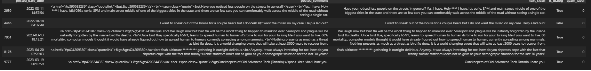
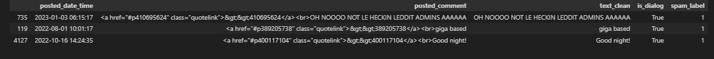
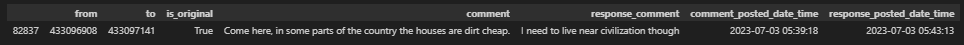
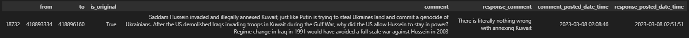
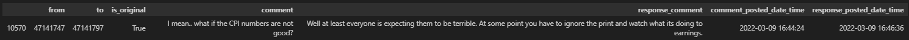
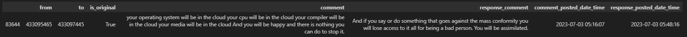
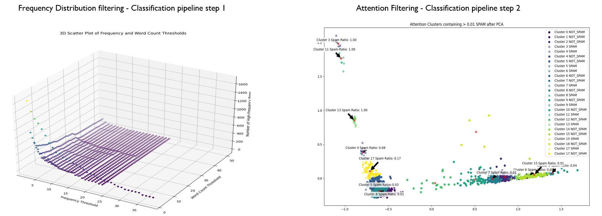
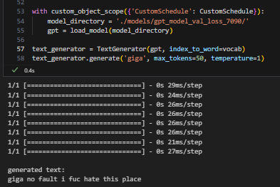
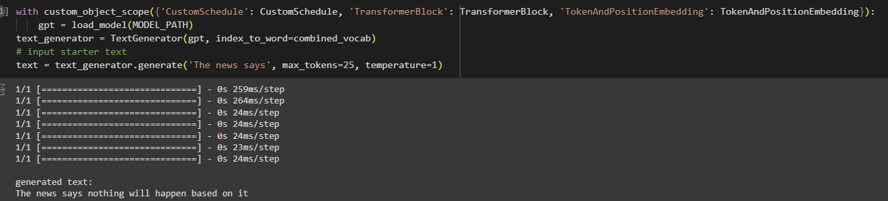

# Project Description

  

The overarching question this project seeks to answer is whether 4chan, despite its controversial reputation, can serve as a potent forum for free and open discussion, offering early insights into significant societal, political, and global phenomena. To assess this, the following project description outlines the machine learning classification pipeline that attempts to categorize text for coherent dialogue. It does this through three distinct steps that employ various machine learning concepts through foundational and novel approaches.

Before getting into the Project structure and File directories, it is crucial to qualify various concepts and definitions used within this project. 

### Project Definitions Examples:
- **Dialog**: The term dialog describes coherent text. It is a conversation that is logical, consistent, and meaningful. It is not a monologue or a series of unrelated statements. It can contain profanity as long as it is used like any other word. Belligerent and incoherent profanity is not considered dialog and will not be labeled as dialog.
    - Examples of rows of qualifying dialog rows:
    
        
        
    - Examples of rows of qualifying non-dialog rows:
    
        

- **Dialog Mapping**: The images below represent two comments mapped to each other using the thread IDs found in the raw data, illustrating the dialog this project aims to identify and select.

    - Example 1:
    
        
        
    - Example 2:
    
        

    - Example 3:
    
        

    - Example 4:
    
        

### Methods and Approaches:
- **Custom Attention Filtering**: This approach leverages BERT's attention mechanisms to extract a five-number summary from the attention values of text documents (where a "document" refers to a single dataframe row, representing the tokenized text of that row). Using KMeans clustering and PCA, the code tokenizes and embeds text with BERT and then processes the attention values to identify key statistics for each attention head. This is followed by clustering the documents and visualizing them in a two-dimensional PCA plot. The function `document_embedding_Five_Number_Summary` extracts the five-number summary from attention values and utilizes a recursive function `flatten` to handle nested lists. The resulting clusters are labeled and can be analyzed to understand their dialog or non-dialog nature, allowing for insights into document categorization (Vaswani et al., 2017).

- **UST (Unsupervised and Semi-Supervised Training) with Self-Training Process**: Incorporates a specialized self-training process, leveraging both unsupervised and semi-supervised learning methods. The iterative UST approach leverages labeled, unlabeled, and validation data. Through a teacher-student paradigm, the student model learns from pseudo-labels generated from high-confidence predictions, while the teacher model guides the learning process. The model continually refines its understanding and enhances its adaptability, responding to changes in the underlying data characteristics (Longpre et al., 2023).

- **FnWC (Frequency Number Word Count Number) Method**: In step 1, FnWC is used for similarity matching, identifying patterns based on frequency and word count, and aligning them with corresponding data clusters. As the data changes, the method dynamically adjusts, enabling efficient clustering and adaptation to evolving data trends. It plays a vital role in pattern recognition and clustering within the dataset.

- **Time-Stratified Random Sampling**: A specific sampling technique used to ensure the quality and robustness of the data, enabling the model to better understand the text's nuances and underlying patterns (Almeida & Hidalgo, 2012).

  

## Data Directory (`data/`)
Relevant data files such as baselines (training datasets), and Time-Stratified Random Samples (TSRS) used for training and testing.
- `baselines/`: Directory containing the original training and baseline dataset splits used in training and testing.
- `TSRS/`: Directory containing `Time Stratified Random Samples` that is the data used during development that was sampled from the primary data source

## Notebooks (`notebooks/`)
The notebooks in this directory provide visualizations and results analysis. The primary notebook is `SPT.ipynb` (Samples, Proportions, and Thresholds), which contains the process used to obtain appropriate samples, proportions, and identifying thresholds used throughout. The `performance_evaluations.ipynb` and `performance_baselines_.ipynb` notebooks provide the final performance evaluationss.

## Source files (`srcs/`)
Contains the main source code files for the project. Summarize each main file below, discussing the methods and intended outcome. 

- `labeler.py` contains the core logic for detecting and labeling dialog in the dataset. It introduces the `DialogDetector` class, which includes various methods to identify dialogs, such as pattern recognition, cosine similarity computations (against training data and `FnWCn logs`), profanity checks, and length thresholds.
- `FnWCn.py` (Frequency number Word Count number) contains the code for the frequency logging process, dealing with logging high-frequency rows. It works based on dynamically set frequency and word count thresholds, either updating existing files or creating new ones, depending on the specific frequency threshold and word count combination.
  - Implements a dynamic frequency logging process that identifies rows where text appears more frequently than dynamically determined thresholds.
  - Utilizes frequency and word count thresholds to log high-frequency rows to separate text files, updating existing files or creating new ones.
- The `attention_filtering` script clusters and analyzes text documents based on attention values. It utilizes BERT's attention mechanisms, applies KMeans clustering, finds the five-number summary of attention values, and optionally visualizes the clustering in a scatter plot using PCA. It provides insights into the data, such as the spam proportion within each cluster, and enables exploratory data analysis to understand the dataset's structure and dialog distribution (Vaswani et al., 2017).
- `classifier.py` contains two main components:
    1. **Model Architecture (via the `create_model` function):**
    - Constructs a sequential neural network with TensorFlow.
    - Comprises dense layers with specific activations, regularization, optional batch normalization, and dropout.
    - Ends with a sigmoid activation for binary classification (Brownlee, n.d.).
    2. **Model Training (via the `train_model` function):**
    - Uses the Adam optimizer, complemented by an exponential decay learning rate.
    - Integrates callbacks for learning rate adjustment, overfitting prevention, and best model saving.
    - The final model is saved in the `saved_models` directory.
- `UST_trainer.py` contains the core logic for unsupervised and semi-supervised training through self-training methods:
    1. **Self-Training Process (`self_train` function):**
        - Leverages labeled, unlabeled, and validation data to iteratively refine model training.
        - Utilizes a teacher-student paradigm, where the student model learns from pseudo-labels of unlabeled data, and the teacher guides the process.
        - Incorporates dropout during inference for robustness in pseudo-labeling.
        - Handles uncertainty filtering and dynamic updating of training data with selected samples from unlabeled data.
        - The process iteratively resets weights, shuffles data, trains the student model, evaluates uncertainty, updates labels, and transfers knowledge from student to teacher.
        - Final results include the trained teacher model, evaluation metrics, and training histories (Longpre et al., 2023).
    2. **Model Reset (`reset_weights` function):**
        - Allows for resetting model weights, providing fresh starts in successive iterations.
    3. **Dropout During Inference (`DropoutInference` class):**
        - A specialized model class that includes dropout during the inference phase, facilitating uncertainty analysis in pseudo-labeling.
- `load_classifier.py` contains the code for loading the trained model and making predictions on new data.
    1. **Ensuring Directory Existence (`ensure_directory_exists` function):**
        - Creates the directory if it doesn't exist.
    2. **Data Saving (`save_data` function):**
        - Saves data to Parquet files.
    3. **Data Loading and Splitting with Random Over Sampler (ROS) (`load_and_split_data_ROS` function):**
        - Loads and splits the data into training, validation, and testing sets.
        - Applies Random Over Sampler (ROS) to handle class imbalance in the training data.
            - Identifies the minority class that has fewer instances.
            - Randomly selects instances from the minority class and duplicates them until the desired balance between the minority and majority classes is achieved (Chawla et al., 2002).
        - Saves the resampled and split data in the specified directory.

## Utils (`utils/`)
The files in this directory are commonly found in ML projects. However, the `contraction_mapping.json` file is a distinctive feature which maps contractions to their expanded forms. This serves as a reference file for punctuated text, allowing for its transformation without significant loss of meaning. Additionally, the `fnSampling.py` file is noteworthy as it contains time-stratified random sampling functions essential for providing high-quality and robust data (Almeida & Hidalgo, 2012).
- `fnPlots.py` contains various plotting and visualization functions related to date and frequency analysis. It includes functions for plotting histograms, scatter charts, and 3D scatter charts, as well as a class for logging and plotting frequency distributions.
    - `FrequencyLoggerPlotter`: A class for logging and plotting frequency distributions. It includes methods for frequency logging, plotting threshold distributions, and 3D scatter plots of frequency and word count thresholds. 

- `fnProcessing.py` functions for text processing and dialog extraction
    - **`remove_profanity` (function):** Replaces words identified as profanity with asterisks, maintaining the original word length.
    - **`find_dialogs` (function):**  Utilizes regular expressions to identify dialog patterns within the data, returning a DataFrame containing 'from' and 'to' thread IDs representing dialog connections.
    - **`augment_dialogs`(function):**  Augments dialog data by adding additional information such as original comments, response comments, and corresponding timestamps. It iterates through the replies DataFrame, finding original and response comments, and populating the DataFrame with this information.

## Plots (`plots/`)
#### Distributions and samples:
- [All data, profiled](/plots/profile_all_data.png)
- [Sample 1](/plots/profile_sampled_sr0.03544_A05P8E01.png)
- [Sample 2](/plots/profile_sampled_sr0.03544_A05P8E01_2.png)
- [Sample 3](/plots/profile_sampled_sr0.03544_A05P8E01_3.png)
- [Sample 4](/plots/profile_sampled_sr0.03544_A05P8E01_4.png)
- [Attention Clusters](/plots/attention_clusters_A05P8E01_1000ksampled.png)
- [Top 1% frequent posts visualized with FrequencyLoggerPlotter](/plots/3dFnWCn_top0.01_F5WC1step4.png)

#### Quantitative benchmarks:
- [Optimal threshold at Alpha 0.05, Power 0.8, Effect 0.01](/plots/optimal_threshold_sr0.03544_A05P8E01_3.png)
- [Spam ratio at Alpha 0.05, Power 0.8, Effect 0.01](/plots/spam_ratio_sr0.03544_A05P8E01_3.png)

#### Qualitative baselines:
- [Dialog examples](/plots/dialogdata_mainexample_readme.png)
- [Non-dialog examples](/plots/nondialogdata_mainexample_readme.png)
- [Dialog 1](/plots/dialog_1.png)
- [Dialog 2](/plots/dialog_2.png)
- [Dialog 3](/plots/dialog_3.png)
- [Dialog 4](/plots/dialog_4.png)
- [Dialog 5](/plots/dialog_5.png)
- [Dialog 6](/plots/dialog_6.png)
- [Dialog 7](/plots/dialog_7.png)
- [Dialog 8](/plots/dialog_8.png)
- [Dialog 9](/plots/dialog_9.png)
- [Dialog 10](/plots/dialog_10.png)
- [Dialog 11](/plots/dialog_11.png)

## Configuration and Setup (config.ini)
Details on how to use `Config.ini`, `Dockerfile`, and `Requirements.txt` for configuring and setting up the project environment.
- `config.ini`: Configuration file containing various settings and parameters.
- `Dockerfile`: Dockerfile to build and run the project in a containerized environment.
- `requirements.txt`: File listing the Python package dependencies required for the project.

## Collection and Processing
The data collection and processing for this project were carried out using various scripts and AWS services. All of the 4chan data was collected using the [4chan API](https://github.com/4chan/4chan-API). This API provided access to the threads, posts, and other relevant data from the 4chan platform. The collected data was then processed and cleaned to ensure quality and relevance for the project's objectives. The scripts related to gathering and processing can be found in the referenced repository.

## Future Work
The plan is to refine a transformer-based language model trained on the data collected and enhanced with GloVe embeddings. The `TextGenerator` class represents the current state of this effort using row 2 from the non-dialog data image above. For example, starting with a known word associated with non-dialog data, the word is used to label incoming text; after successful labels, another word is added. This process will continue until some effectiveness criteria are met and the string is added to the training data and timestamped. In addition to becoming training data, it can be referenced to that specific date and time for later analysis. The generator will used for other learning tasks that will be added later.  

The following points provide reasoning for this approach:
1. Text that appears frequently has a higher probability of being generated, given the appropriate sample.
2. Generating text from a given prefix or starting string will result in variations of the same text nuances and underlying patterns.
Row 2 Non-dialog examples

The example below is test output generated from a custom language model trained on 100,000 random dialog pairs. View the Generative Modeling repository for more details.

[Generative Modeling](https://github.com/joelwk/Generative-Modeling)

These advancements aim to provide deeper insights into text patterns and offer robust tools for analyzing dialogue dynamics, detecting anomalies, and understanding shifts in discussions over time.

## References
- Bird, S., Klein, E., & Loper, E. (2021). Natural Language Processing with Python. In *Natural Language Processing with Python* (3rd ed., ch. 9). O'Reilly Media. Retrieved from https://learning.oreilly.com/library/view/natural-language-processing/9781098136789/ch09.html
- Bird, S., Klein, E., & Loper, E. (2021). Natural Language Processing with Python. In *Natural Language Processing with Python* (3rd ed., ch. 9). O'Reilly Media. Retrieved from https://learning.oreilly.com/library/view/natural-language-processing/9781098136789/ch09.html#:-:text=Implementing%20a%20Naive,reasons%0Afor%20this%3A
- Brownlee, J. (n.d.). How to Develop a Word Embedding Model for Predicting Movie Review Sentiment. *Machine Learning Mastery*. Retrieved from https://machinelearningmastery.com/develop-word-embedding-model-predicting-movie-review-sentiment/
- Almeida,Tiago and Hidalgo,Jos. (2012). SMS dialog Collection. UCI Machine Learning Repository. https://doi.org/10.24432/C5CC84.
- Gunasekar, S., Zhang, Y., Aneja, J., Mendes, C.C., Giorno, A.D., Gopi, S., Javaheripi, M., Kauffmann, P.C., Rosa, G.D., Saarikivi, O., Salim, A., Shah, S., Behl, H.S., Wang, X., Bubeck, S., Eldan, R., Kalai, A.T., Lee, Y.T., & Li, Y. (2023). Textbooks Are All You Need. ArXiv, abs/2306.11644.
- Longpre, S., Yauney, G., Reif, E., Lee, K., Roberts, A., Zoph, B., Zhou, D., Wei, J., Robinson, K., Mimno, D.M., & Ippolito, D. (2023). A Pretrainer's Guide to Training Data: Measuring the Effects of Data Age, Domain Coverage, Quality, & Toxicity. ArXiv, abs/2305.13169.
- Jung, J., West, P., Jiang, L., Brahman, F., Lu, X., Fisher, J., Sorensen, T., & Choi, Y. (2023). Impossible Distillation: from Low-Quality Model to High-Quality Dataset & Model for Summarization and Paraphrasing. ArXiv, abs/2305.16635.
- Vaswani, A., Shazeer, N.M., Parmar, N., Uszkoreit, J., Jones, L., Gomez, A.N., Kaiser, L., & Polosukhin, I. (2017). Attention is All you Need. NIPS.
- Chawla, N. V., Bowyer, K. W., Hall, L. O., & Kegelmeyer, W. P. (2002). SMOTE: Synthetic Minority Over-sampling Technique. Journal of Artificial Intelligence Research, 16, 321–357. https://doi.org/10.1613/jair.953

